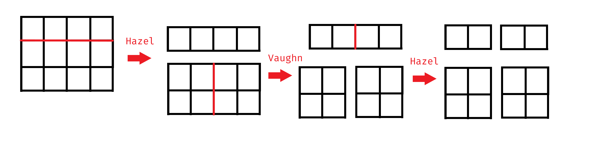

# Cutting Board [I]

Hazel and Vaughn are playing a game called cutting board. The game requires a single board of size ~n \times m~ units which is made up of ~1 \times 1~ unit squares.

Hazel can cut the board horizontally along the lines in between squares, and Vaughn can cut the board vertically along the lines in between squares. Each cut that Hazel and Vaughn makes must separate the board into two pieces.

The game is played where Hazel and Vaughn take turns making a single cut in the board, and the first player unable to make a cut loses.



Since this is a game where all possible moves are known, each cutting board of size ~n \times m~ can be classified in one of 4 ways:

* Hazel has a strategy that wins regardless of who goes first
* Vaughn has a strategy that wins regardless of who goes first
* The first player has a strategy that wins
* The second player has a strategy that wins

Your first problem is to determine which of the 4 games a particular cutting board is.

## Input

Input will contain two space separate integers, ~n~ and ~m~, where ~n~ is the number of columns in the rectangle and ~m~ is the number of rows in the rectangle.

## Output

Output one of the following strings which determines which of the 4 classifications:

* `Hazel`
* `Vaughn`
* `1st Player`
* `2nd Player`

## Constraints

* ~1 \leq n, m \leq 10^{18}~

## Example

#### Input
```
3 2
```

#### Output
```
2nd Player
```

#### Explanation
If Vaughn starts, then:

1. His first cut makes it into ~1\times 2~ and ~2\times 2~ boards.
2. Hazel can then cut the ~1\times 2~ into two ~1\times 1~ boards.
3. Vaughn is then forced to break the ~2\times 2~ into two ~1\times 2~ boards.
4. Hazel can then cut one of the ~1\times 2~ into two ~1\times 1~ boards.
5. Vaughn can't make a cut.

If Hazel starts, then

1. Her first cut makes it into ~2\times 1~ and ~2\times 1~ boards.
2. Vaughn can then cut one of the ~2\times 1~ boards into two ~1\times 1~ boards.
3. Hazel can't make a cut.

So regardless, the 2nd player always wins.
