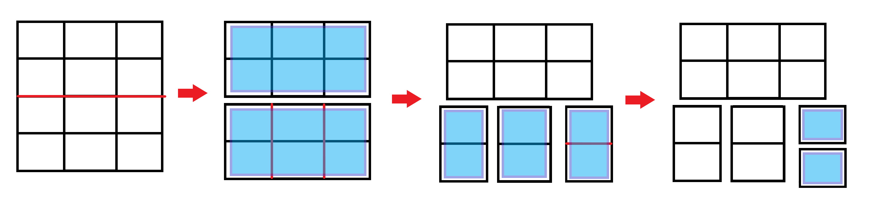

# Cutting Board [II]

**MOST** of this blurb is the same as Cutting Board [I].

Hazel and Vaughn are playing a game called cutting board. The game requires a single board of size ~n \times m~ units which is made up of ~1 \times 1~ unit squares.

Hazel can cut the board horizontally along the lines in between squares, and Vaughn can cut the board vertically along the lines in between squares. Each cut that Hazel and Vaughn makes must separate the board into two pieces.

The game is played where Hazel and Vaughn take turns making multiple cuts in a single board, such that the sliced boards created are of **equal size**.



Note that the boards with a blue background are of the same size.

Since this is a game where all possible moves are known, each cutting board of size ~n \times m~ can be classified in one of 4 ways:

* Hazel has a strategy that wins regardless of who goes first
* Vaughn has a strategy that wins regardless of who goes first
* The first player has a strategy that wins
* The second player has a strategy that wins

Your first problem is to determine which of the 4 games a particular cutting board is.

## Input

Input will contain two space separate integers, ~n~ and ~m~, where ~n~ is the number of columns in the rectangle and ~m~ is the number of rows in the rectangle.

## Output

Output one of the following strings which determines which of the 4 classifications:

* `Hazel`
* `Vaughn`
* `1st Player`
* `2nd Player`

## Constraints

* ~1 \leq n, m \leq 2\times 10^{6}~

## Example

#### Input
```
4 3
```

#### Output
```
Vaughn
```

#### Explanation
If Vaughn starts, then:

1. His first cut makes it into ~2 \times 3~ and ~2\times 3~ boards.
2. Hazel is then forced to cut the ~2\times 3~ into three ~2\times 1~ boards.
3. Vaughn can then cut one of the ~2\times 1~ into two ~1\times 1~ boards.
4. Hazel is then forced to cut the other ~2\times 3~ into three ~2\times 1~ boards.
5. Vaughn can then cut one of the ~2\times 1~ into two ~1\times 1~ boards.
6. Hazel can't make a cut.

If Hazel starts, then

1. Her first cut must cut the ~4\times 3~ into three ~4\times 1~ boards.
2. Vaughn can then cut one of the ~4\times 1~ boards into two ~2\times 1~ boards.
3. Hazel can't make a cut.

So regardless, Vaughn always wins.
