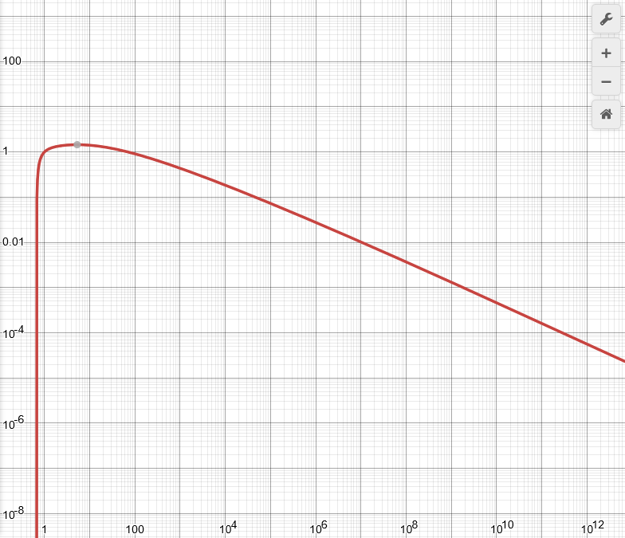

# Divisors [III]

The blurb for this problem is the same as Divisors [I], save for the statement of the problem.

Consider the sequence of all natural numbers, and then for each number, listing each of the divisors of this number in increasing order:

~~
    1 2 3 4 5 6 \ldots
~~

becomes:

~~
    1 1 2 1 3 1 2 4 1 5 1 2 3 6 \ldots
~~

Since this (infinite) sequence has a lot of duplicates, we can notate for each digit whether it is the first, second, third... occurence using a subscript:

~~
    1_1 1_2 2_1 1_3 3_1 1_4 2_2 4_1 1_5 5_1 1_6 2_3 3_2 6_1 \ldots
~~

For this third problem, we are considering taking the reciprocal of every value in this sequence, and summing it:

~~
    \frac{1}{1} + \frac{1}{1} + \frac{1}{2} + \frac{1}{1} + \frac{1}{3} + \frac{1}{1} + \frac{1}{2} + \frac{1}{4} \ldots
~~

For this problem, we want you to estimate the value of the partial sum up to and including some ~i_1~ (The first occurence of some value ~i~)

## Input

Input will contain a single value `i`, representing the sequence value ~i_1~

## Output

Output an estimate of the partial sum up to and including the first occurence of ~\frac{1}{i}~.

In order to receive ~30\%~ of the grade, your solution should have maximum error at most ~\ln(i)~.

In order to be judged as correct and receive full marks, your solution should have maximum error at most ~\frac{1}{i} + 2\sqrt{i}\ln ( 1 + \frac{\ln{i}}{i} ) + \sqrt{i}*2^{-55+\log_2(i)}~.
For reference, this error looks like the following (note the logarithmic axis):



## Constraints

* ~1 \leq i \leq 10^{11}~

## Example

#### Input
```
5
```

#### Output
```
6.783333333333333
```

Although anything ~\pm 1.447997~ from this answer would suffice.
