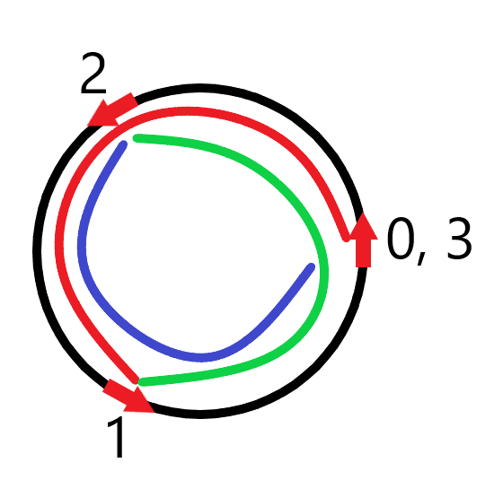

# Misc [0]

You are a swinging on circular string in a counter clockwise direction, and every second you will move ~\frac{a}{b}~ revolutions around the circle.

You start off facing North, but wonder if at any integer second in the future you'll be facing exactly South, East or West.

## Input

Input will contain two space-separated positive integers ~a~ and ~b~.

## Output

If you will never face South, East or West at an integer time, print `Free!`

Otherwise, print `Other axis!`

## Constraints

* ~1 \leq a, b \leq 10^6~

## Example

#### Input

```
4 6
```

#### Output

```
Free!
```

#### Explanation

Every second you will move ~\frac{4}{6} = \frac{2}{3}~ rotations, which looks like the following at seconds 0, 1, 2, 3 (and then repeats):



So you'll never be facing any cardinal direction but North.
